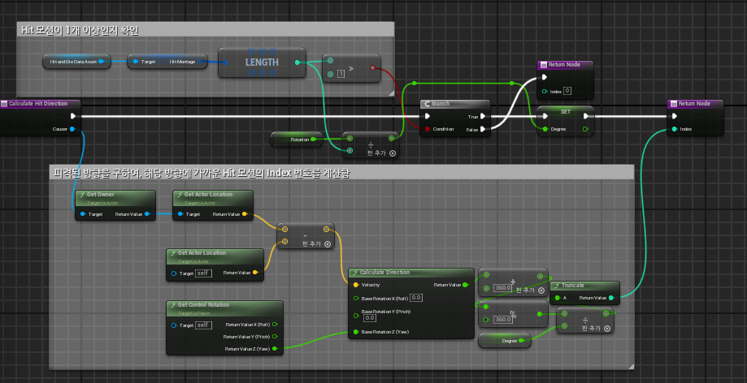
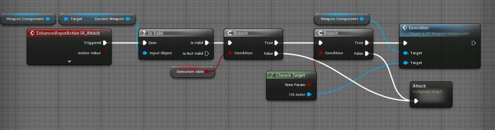
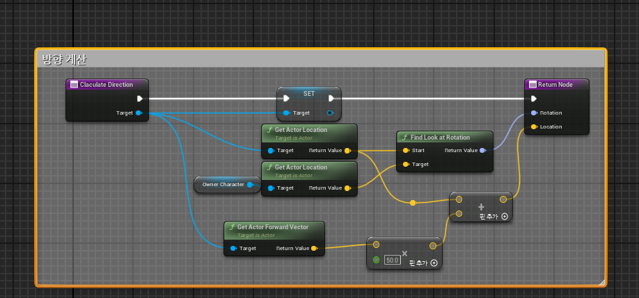

# 김대겸 BP_RPG_Game 포트폴리오
### 영상(https://www.youtube.com/watch?v=9eNy_uMKI2U&list=PLjBaD_r8cuGL5i2sCuhN_u-S6PB2jlGml)
### 기획서(https://github.com/kimeorua/SoulsLikeGameProposal)

## 목차
+ ### [1.개요](#1-개요)
+ ### [2.개발 툴 및 언어](#3-개발-툴-및-언어)
+ ### [3.핵심 개발 기술](3-핵심-개발-기술)
+ ### [4.후기](4-후기)

## 1 개요
+ ### 장르: 액션RPG, 소울라이크
+ ### 컨셉1. 높은 난이도의 보스와의 전투를 통한 성취감을 느끼는 게임
+ ### 컨셉2. 보스의 패턴에 맞춰서 대응하는 공략하는 게임
+ ### 컨셉3. 여러 타입의 플레이어 캐릭터를 만들어 다 회차를 진행 
+ ### 플랫폼: PC
+ ### 특이 사항: C++로 게임을 제작하기전 간단한 전투 시스템 구현을 위해 BP를 활용하여 제작
+ ### 작업 기간: 2024.07.31 ~ 2024.08.26

## 2 개발 엔진 및 언어
+ ### 개발 언어: Blueprint
+ ### 개발 엔진: Unreal Engine5.4

## 3 핵심 개발 기술
### 플레이어 4방향 피격 모션 출력

### 코드 설명

+ #### 해당 함수가 실행되면 피격모션이 들어있는 DataAsset을 가져와, HitMontage의 배열 크기를 구함.
+ #### 해당 크기가 1보다 크면 방향을 계산하여 피격 모션 배열의 Index 번호를 구함.
+ #### 피격 모션 배열의 Index 번호는 (공격을 한 객체의 위치 - 공격을 맞는 객체의 위치)를 통해 Location을 구함
+ #### 공격을 맞는 캐릭터의 ControllerRotation.Yaw와 위에서 구한 Location을통해 calculate Direction함수를 통해 각도를 구함.
+ #### 위에서 구한 각도는 -180' ~ 180'의 값이 나오는데, HitMontage 배열에는 0'~360'의 값을 기준으로 순서대로 추가함.
+ #### 따라서 계산된 각도에 360'를 더하고 이 값을 360'로 나눠 나머지 값을 계산하면 0~360의 값을 구할 수 있음.
+ #### 위에서 0~360의 값으로 나온 각도를 (HitMontage의 길이 / 360 통해) 나온 Degree 값으로 나눠, 반올림을 통해, Index값을 구하고, 해당 번호의 애니메이션을 출력 함.

### 적 기절시 처형 공격 실행
+ ### 공격 작동

+ ### 처형 작동시 회전값 및 위치 계산

### 코드 설명
+ #### 플레이어가 좌클릭을 누르면 처형 공격 가능 여부를 판단함.
+ #### 처형 공격 가능일 경우, LineTrace를 통해, 특정 거리 안에 공격 할 수 있는 객체가 있으면(CheakTarget() 함수), 처형 공격을 실행 함.
+ #### 처형 공격이 작동 할때, 플레이어 캐릭터의 위치를 보정하고, 적 캐릭터의 회전값을 보정해야 함.
+ #### 따라서, 공격을 받는 Target이 공격을 하는 객체를 바라보도록 FindLookAtRoation을 통해 회전 값을 계산하여, 적용함.
+ #### 위치는 공격을 받는 Target의 ActorForwardVector * 50.0f(처형 공격 가능 거리)를 통해 해당 객체의 앞부분 위치를 구한 후, 해당 위치로 플레이어 캐릭터를 이동 시킴. 

## 4 후기
### 4-1 프로토타입의 중요성.
+ #### 프로토타입 제작을 처음 해보았는데, 기초적인 전투 시스템을 간단하게 BP를 활용하여 구현 해본 결과, 원하는 기능을 제작하는데 있어 기초적인 틀을 만들수 있었음
+ #### 또한 처음부터 C++로 작업을 할때에는 여려번 수정을 하게되거나, 갈피를 못잡는 경우도 있었는데 프로토타입에서 이미 구현한 기능이기에, 기본적인 작업 속도도 많이 향상 되었음.  
+ #### 이 경험을 통해, 프로토타입 제작의 중요성을 알게 되었음.

### 4-2 Component단위의 개발 방식.
+ #### 이전까지는 플레이어 기능은 플레이어 캐릭터에 전부 구현 하여, Class의 양이 너무 많다고 느낌.
+ #### 그러한 점을 기억하여, 이번에는 Component 단위로 쪼개서 구현을 해봄.
+ #### 무기를 관리하는 WeaponComponent나, 락온 기능을 담당하는 LockOnComponent, 플레이어의 상태를 확인하는 StateComponent, 플레이어의 스탯 정보를 관리하는 StatComponent를 제작하여 관리함.
+ #### 처음 해보는 방식이라 살짝 버벅이며 제작하였으나, 결과적으로 한 Class에 들어가는 코드의 길이가 줄어 파악 하기 쉬워졌고, 기능을 Component로 따로 구현하니, 기능을 추가하거나, 필요없는 기능은 뺄 수 있게 되었음.
+ #### 이 경험을 통해 Component단위의 개발 방식의 이점을 알게 되었음.
